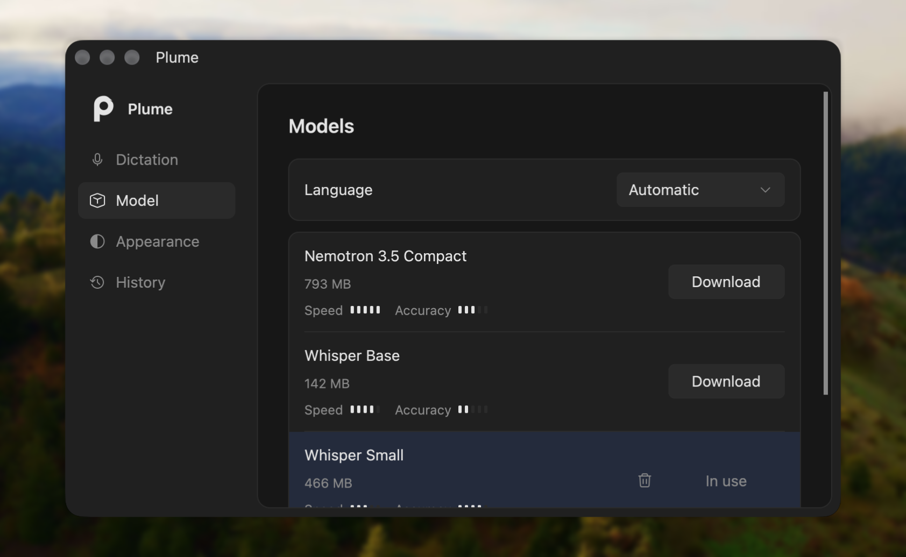

  

# Plume

**Speak. Release. Keep writing.**

Plume turns your voice into text in the app you're already using. Hold a shortcut, speak, and release to insert your words. Transcription runs on your computer, so your audio stays with you.

**[Get Plume →](https://github.com/LeoMartinDev/Plume/releases)** · [Report an issue](https://github.com/LeoMartinDev/Plume/issues)

## Get Plume

Download the latest version from [Releases](https://github.com/LeoMartinDev/Plume/releases/latest).

| Your computer | Build to choose |
| --- | --- |
| macOS — Apple Silicon (M1 or newer) | macOS Apple Silicon |
| Windows — 64-bit Intel or AMD | Windows x64 |
| Linux — 64-bit Intel or AMD, X11 | Linux x64 |

Run the Windows `.exe` installer or macOS `.pkg` installer, then open Plume from the Start menu or Applications. On Ubuntu 24.04 or newer, install the `.deb` with `sudo apt install ./Plume-vVERSION-x86_64-unknown-linux-gnu.deb`. Speech models are downloaded separately inside the app.

Linux downloads are built on Ubuntu 24.04 and need an X11 session and a system tray; Wayland support is planned. Release installers are not publisher-signed or notarized, so macOS or Windows may show a security warning.

## Start dictating

1. Open Plume and choose a model in **Settings → Model**. Download it once.
2. Allow microphone access. On macOS, also enable the Accessibility and Input Monitoring permissions requested by the app.
3. Click into a text field in your editor, browser, chat or document.
4. Hold **Ctrl + Space**, speak, then release. Plume inserts the finished transcription.

Press **Esc** while recording to cancel. You can change the shortcut in **Settings → Dictation**.

Plume stays in your menu bar or system tray. Click its icon to reopen settings; right-click it for the menu. Closing settings keeps dictation available in the background.

## What you can do

- **Dictate across your desktop.** Write messages, notes, documents and prompts in the app you already have open.
- **Keep your audio local.** Recognition runs on your computer, without an account or audio uploads. Once a model is downloaded, dictation works offline.
- **Choose your model.** Pick a smaller download, faster response or higher accuracy, and switch models from settings.
- **Dictate in French or English.** Choose either language explicitly or use automatic language detection. Models also cover additional languages listed below.
- **Make insertion work for you.** Use automatic insertion, clipboard paste or typing, with an optional copy-to-clipboard fallback when insertion fails.
- **Find previous transcriptions.** Copy or delete entries from local history. Set how long to keep them and how many to retain, or choose unlimited history.
- **Match your desktop.** Choose light, dark or system appearance and keep Plume close at hand in the tray.
- **Stay up to date.** Plume checks GitHub Releases at startup. Download an update from **Settings → Updates**, then choose **Restart and install** when you're ready.

## Available models

All four models run locally and support French and English. Download and manage them directly in **Settings → Model**.

| Model | Download size | Language coverage | Profile |
| --- | --- | --- | --- |
| **Nemotron 3.5 Compact** | 793 MB | 35 languages | Prioritizes fast responses |
| **Whisper Base** | 142 MB | 99 languages | Smallest download; a lightweight starting point |
| **Whisper Small** | 466 MB | 99 languages | Balanced speed and accuracy |
| **Whisper Large-v3-Turbo** | 1.5 GB | 99 languages | Prioritizes accuracy, with a larger download |

Sizes are approximate. Speed and recognition quality depend on your computer, microphone, language and recording conditions.

The language picker currently offers **Automatic**, **French** and **English**. The language counts describe each model's broader coverage.

## Your data stays on your computer

Your audio is processed locally. An internet connection is needed to download models and check or download app updates, but not for dictation afterward. Transcription history is stored locally too; you control its retention and can delete it from settings.

## Feedback and development

Found a problem or have an idea? [Open an issue](https://github.com/LeoMartinDev/Plume/issues) with your operating system, selected model and what happened.

For building from source, configuration, troubleshooting, tests and release tooling, see the [development guide](docs/development.md).
